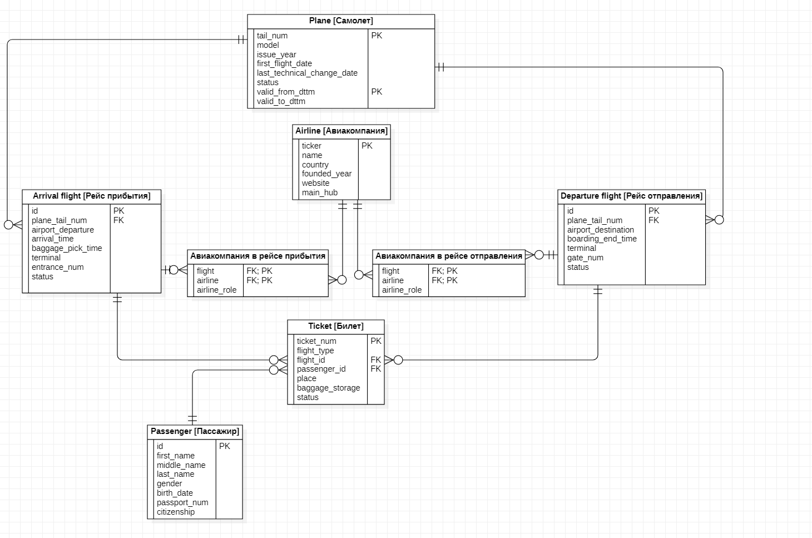

# Курс "Базы Данных". Курсовая работа
## Логическая модель




## Комментарии к модели:

Таблица ```Самолёт``` будет scd2-версионной.

Таблицы ```Авиакомпания в рейсе прибытия/отправления``` созданы для реализации связи многие ко многим

Атрибут ```Статус``` в таблице ```Билет``` означает статус пассажира в рамках конкретного рейса, например: "прошел регистрацию", "отстранен от полета", "на борту".

База находится в НФ-3, так как
* Находится в НФ-2 (в каждой таблице 1 ключевой атрибут)
* Нет транзитивных зависимостей
